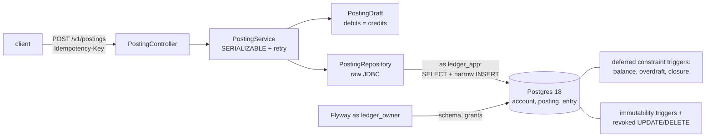
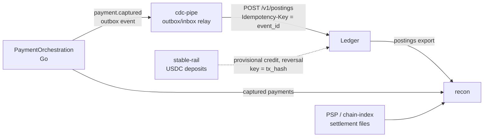

# Ledger

A double-entry ledger in **Java 25 + Spring Boot + Postgres**. Accounts classify immutable
entries; a _posting_ is the atomic set of entries that moves value. Balances are derived from
entries — no balance column exists. Nothing is ever updated in place or deleted; corrections are
exact reversal postings.



## One command

```sh
make test                  # 23 unit/domain tests, no database
make integration-test      # 75 Postgres tests (Testcontainers, needs Docker)
```

No Docker? Point both the tests and a local server at any Postgres 18 you
can reach as a superuser (it must be disposable: the test bootstrap drops
and recreates the ledger databases and roles):

```sh
LEDGER_TEST_ADMIN_URL=jdbc:postgresql://localhost:5432/postgres \
LEDGER_TEST_ADMIN_USER=postgres ./gradlew integrationTest
LEDGER_PG_ADMIN_URL=postgres://postgres@localhost:5432/postgres ./scripts/run-local.sh
./scripts/load-test.sh 2000 16 spread    # against the running server
```

## Results

Measured 2026-10-05 on an Apple M4 Mac mini (10 cores, 16 GB), JDK 25,
Homebrew Postgres 18.6 on loopback, the API from `scripts/run-local.sh`,
other builds running on the machine.

| Check                                        | Command                                               | Result                                                             |
| -------------------------------------------- | ----------------------------------------------------- | ------------------------------------------------------------------ |
| Unit/domain tests                            | `./gradlew test`                                      | 23 pass                                                            |
| Postgres integration tests                   | `LEDGER_TEST_ADMIN_URL=... ./gradlew integrationTest` | 75 pass                                                            |
| Load, 2000 postings, 16 clients, 32 accounts | `./scripts/load-test.sh 2000 16 spread` (3 runs)      | 655-1207 postings/s; p50 1.1-3.2 ms, p95 70-117 ms, p99 154-274 ms |
| Same, 4 clients                              | `./scripts/load-test.sh 2000 4 spread`                | 856 postings/s; p50 1.2 ms, p95 28 ms                              |
| One hot account, 16 clients                  | `./scripts/load-test.sh 1000 16 hot`                  | 799 postings/s; p50 2.1 ms, p95 100 ms                             |

Every run ends with the load accounts summing to exactly zero. The tail is
the SERIALIZABLE retry loop: 200-900 serialization retries per 2000
postings, and 1-5 postings per run exhausted all 5 attempts and got a 503,
which the client retries safely under the same idempotency key. Most of
those aborts are false positives from page-level predicate locks on shared
indexes (see exercise 5 in [docs/LEARN.md](docs/LEARN.md)). The first run
includes JVM warm-up. A laptop baseline, not a capacity claim.

## How it works

An account is one row — Cash, Rent Expense, Customer Deposits. Its type
(asset, liability, equity, revenue, expense) decides whether a debit or a credit
raises its balance.

Money moves only in postings: matching debit and credit entries written in one
tx. Paying $500 rent writes a $500 debit to Rent Expense and a $500
credit to Cash. Amounts are integer minor units.

Rows are never updated or deleted; mistakes are reversed with a reversal posting.

Rules are in [AGENTS.md](AGENTS.md), trade-offs in [docs/DESIGN.md](docs/DESIGN.md), a guided
tour with exercises in [docs/LEARN.md](docs/LEARN.md).

The schema is [`V1__journal_schema.sql`](src/main/resources/db/migration/V1__journal_schema.sql): three tables accounts, postings, entries.

## Guarantees and their proof

### Every posting balances

Every posting balances in its own currency: debits equal credits.
Enforced twice: once in `PostingDraft` (BigInteger), and again by a deferred Postgres trigger.
`PostingBalanceTest` attacks the trigger with raw SQL, bypassing our app.

### Conservation

All entries sum to zero per currency.
Audited in `LedgerIntegrationTest`, and against a live DB by `scripts/verify.sh`.

### No UPDATE/DELETE on postings, entries, and accounts

The app connects to Postgres as `ledger_app`, a DB user that Postgres forbids
from updating or deleting rows in those tables (so even buggy app code can't
edit history). If the app is ever granted wider permissions by mistake, triggers
that run before updates/deletes abort the attempt anyway.
`ImmutabilityTest` connects as `ledger_app` to prove the DB refuses.

Corrections are additive
Reversals are inverse postings made with a new idempotency key.

### One currency per posting

Composite foreign keys tie posting, account, and entry currency together.
`CurrencyTest` proves a mismatch fails.

### Idempotent posting creation

Each posting carries a unique idempotency key plus a fingerprint of the request.
Replaying a key returns the original posting instead of writing entries twice;
a different body under the same key is an HTTP 409 conflict.
Proven three ways: posting the same key twice in a row returns the same posting
with no new rows; 20 identical requests fired at once produce exactly one posting
(the unique key picks the winner); and reusing a key for different amounts is
rejected with 409.

### Concurrent postings sum exactly

A 50-thread posting storm against one account lands exactly on the arithmetic sum.

### Explicit overdraft policy

An overdraft is a posting that would drive an account balance below zero.
Each account declares ALLOW/DENY for overdrafting at account creation.
DENY aborts postings (409) if they overdraft.
Enforced in the app and by a deferred constraint.

A REPEATABLE READ demo fires two 8,000 withdrawals at 10,000 and leaves -6,000.
So real postings run SERIALIZABLE instead (see `docs/DESIGN.md` §3).

### Crash atomicity

`scripts/crash-recovery.sh` SIGKILLs the app at two points. If the kill lands
before commit, Postgres rolls the open tx back, so no partial posting
survives — no header without entries, no entries without a header. If it lands
after commit but before the HTTP response is sent, the client retries the same key and gets
the committed posting back with no second write.

## Quickstart

```sh
cp .env.example .env
make upd        # build, migrate (owner), start app (runtime role)
make demo       # isolated 11-step walkthrough; asserts every claim above
make verify     # non-empty closure + conservation audit of the dev DB
make crash-test # isolated SIGKILL harness
make backup     # pg_dump to backups/ (gitignored); DUMP=... make restore replays + audits
make test integration-test
```

## Observability

`/actuator/health` (liveness) and `/actuator/health/readiness` (JVM + bounded Postgres check);
Prometheus exposition with low-cardinality `ledger.postings{kind,outcome}`,
`ledger.posting.commit` latency, and retry gauges. Optional local Grafana:
`docker compose --profile observability up`. Integrity audit is an explicit command (`make
verify`), never a scrape.

## Connections: the money stack

The ledger is the book of record at the end of a six-repo payment chain.
It never calls anyone; other systems post to it.



- **PaymentOrchestration** decides whether money moved; this repo records
  that it did. The orchestrator is deliberately not a ledger.
- **cdc-pipe** is the relay pattern between them. Delivery is
  at-least-once, so the event id becomes this API's idempotency key and a
  redelivered event replays the original posting instead of booking twice.
- **stable-rail** models USDC deposits as provisional credits and reorgs
  as exact-inverse reversals, the same correction model as here (today
  against an in-process Ledger-shaped fake).
- **recon** matches this ledger's postings against what the orchestrator
  captured and what the PSP settled.

`recon/scripts/money-stack.sh` runs that chain live: orchestrator, relay
with duplicate delivery, this service via `scripts/run-local.sh`, and recon.
